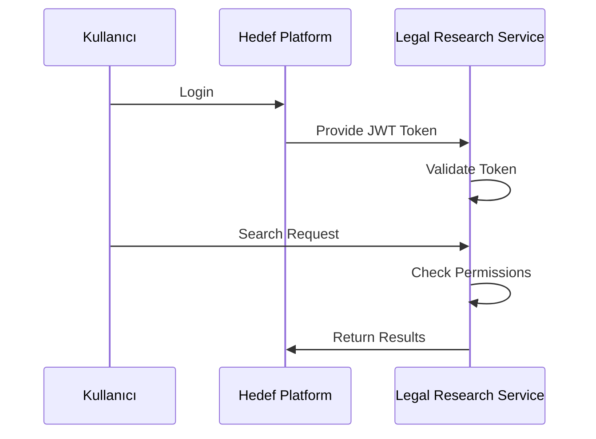

# 🔧 UYAP/Yargıtay Veri Çekme Sistemi - Entegrasyon Planı

## 📊 Mevcut Sistem Analizi

### Ana Bileşenler
1. **Backend (Flask)**
   - `web_panel.py`: Ana Flask uygulaması
   - API endpoints: `/api/start_search`, `/api/status`, `/api/download_excel`
   - Selenium scraping fonksiyonları
   - Threading ile asynchronous işlemler

2. **Frontend**
   - `templates/index.html`: React benzeri interaktif UI
   - CSS: UYAP tarzı tasarım, responsive layout
   - JavaScript: Durum yönetimi, AJAX, pagination

3. **Scraping Modülleri**
   - Selenium Webdriver entegrasyonu
   - Error handling ve retry mekanizması
   - Data extraction ve validation

---

## 🎯 Hedef Platform Entegrasyon Seçenekleri

### Seçenek 1: Microservice Yaklaşımı
```
Hedef Platform (React/Vue/Angular)
├── Frontend Integration Layer
├── API Gateway
└── UYAP Scraper Service (Containerized)
    ├── Flask API (FastAPI'e çevrilecek)
    ├── Selenium WebDriver
    └── Redis/Celery Task Queue
```

### Seçenek 2: Plugin/Widget Yaklaşımı
```
Hedef Platform Menu/Widget Bar
├── UYAP Veri Çekme Widget
│   ├── Embedded iframe veya web component
│   ├── Styling override (platform temasına uyum)
│   └── Messaging/RPC integration
```

### Seçenek 3: Native Integration
```
Hedef Platform Codebase
├── UYAP Scraper Module (language-specific)
├── UI Components (native styling)
├── Database integration 
└── Authentication integration
```

---

## 🔄 Entegrasyon Adımları (Fazlar)

### Faz 1: Hazırlık ve Kod Refactoring (1-2 hafta)
1. **Backend Modülerleştirme**
   ```python
   # Mevcut web_panel.py'yi modüllere böl
   ├── services/
   │   ├── uyap_scraper_service.py
   │   ├── yargitay_scraper_service.py
   │   └── data_processor_service.py
   ├── api/
   │   ├── search_api.py
   │   ├── status_api.py
   │   └── download_api.py
   └── models/
       ├── decision_model.py
       └── search_context_model.py
   ```

2. **Configuration Externalization**
   ```python
   # config.py
   SCRAPING_CONFIG = {
       'headless': True,
       'timeout': 30,
       'retry_attempts': 3,
       'rate_limit_delay': 2
   }
   
   DATABASE_CONFIG = {
       'host': 'target_platform_db',
       'schema': 'legal_research'
   }
   ```

### Faz 2: API Standardizasyonu (1 hafta)
1. **OpenAPI/Swagger Documentation**
   ```yaml
   # api_spec.yaml
   /api/v1/legal-search:
     post:
       requestBody:
         content:
           application/json:
             schema:
               type: object
               properties:
                 keyword: {type: string}
                 system: {type: string, enum: [UYAP, YARGITAY]}
                 limit: {type: integer, default: 100}
   ```

2. **Data Model Standardization**
   ```python
   # models/decision.py
   class DecisionModel:
       case_number: str
       court: str
       date: datetime
       content: str
       metadata: dict
   ```

### Faz 3: Frontend Componentlarının Adaptasyonu (2-3 hafta)

#### React Component Örneği:
```jsx
// UYAP Search Component
import React, { useState, useEffect } from 'react';

const UYAPSearchWidget = ({ platformTheme, authToken }) => {
  const [searchState, setSearchState] = useState({
    isRunning: false,
    results: [],
    progress: 0
  });
  
  // Platform temalı stil uygulama
  const componentStyle = {
    ...platformTheme.widgets.search,
    ...PLATFORM_INTEGRATION_STYLES
  };
  
  return (
    <div style={componentStyle}>
      {/* Platform API'leri ile entegre edilmiş UI */}
    </div>
  );
};
```

#### Vue Component Örneği:
```vue
<template>
  <div class="uyap-search-widget" :class="platformClasses">
    <!-- Platform stillerine uyarlanmış template -->
  </div>
</template>

<script>
export default {
  name: 'UYAPSearchWidget',
  props: ['platformConfig'],
  inject: ['theme', 'auth']
}
</script>
```

### Faz 4: Authentication & Authorization Integration (1 hafta)

1. **JWT Token Integration**
   ```python
   # Middleware/auth.py
   def token_auth_middleware():
       token = request.headers.get('Authorization')
       user = verify_platform_token(token)
       g.current_user = user
   ```

2. **Role-Based Access Control**
   ```python
   # permissions.py
   LEGAL_RESEARCH_PERMISSIONS = {
       'basic': ['read_decisions'],
       'premium': ['read_decisions', 'export_data'],
       'admin': ['full_access']
   }
   ```

### Faz 5: Database Integration (1 hafta)

```python
# database/models.py
from sqlalchemy import Column, String, DateTime, Text, JSON
from target_platform.db import BaseModel

class LegalDecision(BaseModel):
    __tablename__ = 'legal_decisions'
    
    id = Column(String(36), primary_key=True)
    search_keyword = Column(String(255), nullable=False)
    case_number = Column(String(100))
    court = Column(String(255))
    decision_date = Column(DateTime)
    content = Column(Text)
    metadata = Column(JSON)
    platform_user_id = Column(String(100))  # Hedef platform user ID
    
    # Foreign key to target platform user table
    user_id = ForeignKey('users.id')
```

### Faz 6: CI/CD ve Deployment (1 hafta)

1. **Docker Containerization**
   ```dockerfile
   # Dockerfile
   FROM python:3.11-slim
   
   COPY requirements.txt .
   RUN pip install -r requirements.txt
   
   COPY scraper_services/ /app/scraper_services/
   COPY config/ /app/config/
   
   EXPOSE 5000
   CMD ["python", "-m", "scraper_services.app"]
   ```

2. **Platform-Specific Build Scripts**
   ```bash
   # build-platform.sh
   #!/bin/bash
   TARGET_PLATFORM=$1
   
   case $TARGET_PLATFORM in
     "react")
       npm run build:react-component
       ;;
     "vue")
       npm run build:vue-component  
       ;;
     "angular")
       npm run build:angular-module
       ;;
   esac
   ```

---

## 🛠️ Entegrasyon Araçları ve Kütüphaneler

### Backend Entegrasyonu:
```python
# requirements-integration.txt
fastapi==0.104.1          # Flask yerine modern alternatif
sqlalchemy==2.0.23         # Database ORM
celery==5.3.4              # Task queue
redis==5.0.1              # Cache/Session store
uvicorn==0.24.0           # ASGI server
pydantic==2.5.0           # Data validation
```

### Frontend Entegrasyonu:
```javascript
// Package.json additions
{
  "dependencies": {
    "@uiw/react-json-view": "^2.0.0",
    "axios": "^1.6.0",
    "socket.io-client": "^4.7.4"
  },
  "peerDependencies": {
    "react": ">=17.0.0"
    // Platform'a göre
  }
}
```

---

## 📁 Dosya Yapısı (Entegrasyon Sonrası)

```
hedef_platform/
├── legal-research-module/
│   ├── components/
│   │   ├── UYAPSearchWidget.jsx
│   │   ├── DecisionResultsTable.jsx
│   │   └── PaginationControls.jsx
│   ├── services/
│   │   ├── legalSearchAPI.js
│   │   └── dataProcessor.js
│   ├── styles/
│   │   ├── widget.theme.dark.css
│   │   ├── widget.theme.light.css
│   │   └── responsive.css
│   ├── utils/
│   │   ├── errorHandling.js
│   │   └── dataValidation.js
│   ├── config/
│   │   ├── apiEndpoints.js
│   │   └── scrapingConfig.js
│   └── docs/
│       ├── integration-guide.md
│       └── api-specification.md
├── backend-services/
│   ├── scraper-service/
│   │   ├── app/
│   │   │   ├── api/
│   │   │   │   └── v1/
│   │   │   │       ├── search.py
│   │   │   │       └── status.py
│   │   │   ├── core/
│   │   │   │   ├── config.py
│   │   │   │   └── security.py
│   │   │   ├── models/
│   │   │   │   └── decision.py
│   │   │   └── services/
│   │   │       ├── uyap_scraper.py
│   │   │       └── yargitay_scraper.py
│   │   ├── Dockerfile
│   │   ├── requirements.txt
│   │   └── docker-compose.yml
│   └── worker-service/
│       ├── tasks/
│       │   ├── scraping_tasks.py
│       │   └── data_processing.py
│       ├── celery_app.py
│       └── Dockerfile
└── deployment/
    ├── kubernetes/
    │   ├── scraper-deployment.yaml
    │   └── ingress.yaml
    ├── docker-compose.yml
    └── env.example
```

---

## 🔒 Güvenlik ve Compliance

### Authentication Flow:


### Data Privacy:
- Veri saklama politikası uygulama
- GDPR/KKVK uyumlu loglama
- Kullanıcı verilerini anonimleştirme
- Search geçmişi temizleme

---

## 📈 Performance Optimizasyonu

### Caching Strategy:
```python
# redis_cache.py
import redis
from datetime import timedelta

class SearchCache:
    def __init__(self):
        self.redis_client = redis.Redis(host='cache')
    
    def cache_search_results(self, keyword, results, ttl_hours=24):
        cache_key = f"legal_search:{keyword}"
        self.redis_client.setex(
            cache_key, 
            timedelta(hours=ttl_hours),
            json.dumps(results)
        )
```

### Async Processing:
```python
# async_tasks.py
from celery import Celery

@celery_app.task
async def process_search_async(keyword, user_id):
    """Async search processing"""
    results = await uyap_scraper.search_decisions(keyword)
    await store_results(user_id, results)
    await notify_user(user_id, len(results))
```

---

## 🧪 Testing Strategy

### Test Coverage:
```python
# tests/test_integration.py
class TestLegalResearchIntegration:
    async def test_search_flow(self):
        """End-to-end search flow test"""
        search_request = SearchRequest(
            keyword="tazminat",
            system="UYAP",
            limit=10
        )
        results = await legal_service.search(search_request)
        assert len(results.decisions) == 10
        
    async def test_user_permissions(self):
        """Test permission-based access"""
        # Test case implementations
```

---

## 🚀 Deployment Pipeline

### GitHub Actions Workflow:
```yaml
# .github/workflows/integration-deploy.yml
name: Legal Research Module Integration
on:
  push:
    branches: [integration-branch]
  pull_request:
    branches: [main]

jobs:
  build-and-test:
    runs-on: ubuntu-latest
    steps:
      - uses: actions/checkout@v3
      - name: Build Docker Images
        run: |
          docker build -t scraper-service .
          docker build -t ui-component ./frontend
      - name: Run Integration Tests
        run: pytest tests/integration/
      - name: Deploy to Staging
        if: github.ref == 'refs/heads/integration-branch'
        run: kubectl apply -f kubernetes/
```

---

## 📝 Entegrasyon Checklist'i

### Hazırlık Aşaması:
- [ ] Hedef platform teknoloji stack analizi
- [ ] Mevcut kod refactoring ve modülerleştirme
- [ ] API spesifikasyonu hazırlama
- [ ] Test ortamı kurulumu

### Development Aşaması:
- [ ] Frontend componentları adaptasyonu
- [ ] Backend servisleri entegrasyonu
- [ ] Authentication/Authorization implementation
- [ ] Database integration
- [ ] Error handling ve logging

### Testing Aşaması:
- [ ] Unit testler
- [ ] Integration testleri
- [ ] E2E testleri
- [ ] Performance testleri
- [ ] Security audit

### Deployment Aşaması:
- [ ] Containerization
- [ ] CI/CD pipeline kurulumu
- [ ] Monitoring ve logging
- [ ] Documentation yazım
- [ ] User training

---

## 💡 Önemli Notlar

1. **Phased Approach**: Entegrasyonu aşamalı olarak yapın
2. **Platform Compatibility**: Hedef platform versiyonu ile uyumluluk kontrolü
3. **Data Migration**: Mevcut verilerin güvenli taşınması
4. **Rollback Strategy**: Sorun durumunda geri dönüş planı
5. **Monitoring**: Gerçek zamanlı sistem izleme

---

Bu plan, sisteminizi herhangi bir modern web platformuna eksiksiz entegre etmek için gereken tüm adımları içermektedir. Platform spesifik detayları değerlendirdikten sonra, uygun fazları seçerek implementasyona başlayabilirsiniz.
